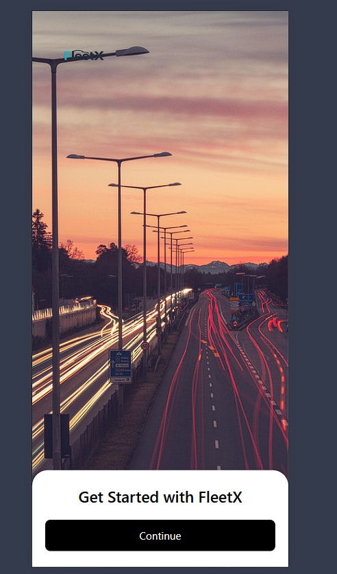
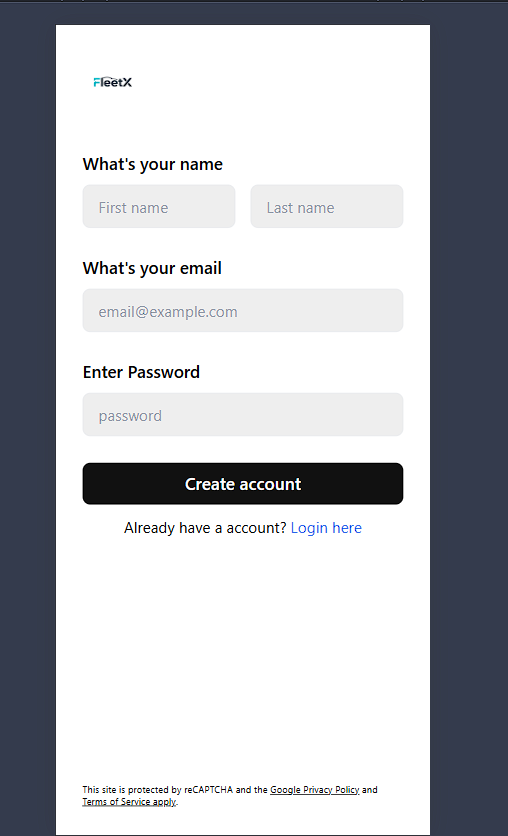
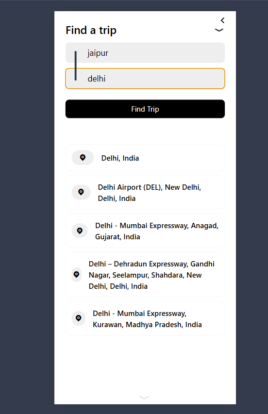
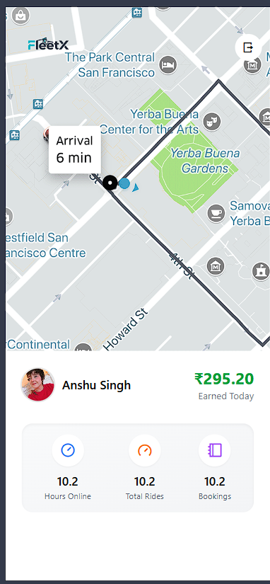

# 🚖 Fleetx Cab Booking Platform

A full-stack, real-time ride-hailing web app (like Uber/Ola) built with the MERN stack. Users can book rides, captains (drivers) receive requests instantly, and both sides get live updates through Socket.IO.

**Live Demo:** _add link after deployment_

---

## ✨ Features

**For Users**
- Register / login with JWT authentication
- Search pickup and destination with Google Maps address autocomplete
- Fare estimates for Car, Motorcycle and Auto
- Real-time ride status: looking for driver → driver assigned → ride started → ride completed
- OTP-based ride start for security
- Live location tracking on an interactive map (Leaflet)

**For Captains (Drivers)**
- Separate captain signup / login with vehicle details
- Instant new-ride popup via Socket.IO
- Live location updates sent to the server every 10 seconds
- Accept ride, verify user OTP, start and finish ride

**Security**
- Passwords hashed with bcrypt
- JWT stored in cookie / Authorization header
- Logout blacklists tokens (auto-expire after 24 hours)
- Protected routes on both frontend and backend

---

## 🛠️ Tech Stack

| Layer | Technology |
| ----- | ---------- |
| Frontend | React, Vite, Tailwind CSS, React Router, GSAP, Leaflet / React-Leaflet |
| Backend | Node.js, Express.js |
| Database | MongoDB with Mongoose (geo-queries for nearby captains) |
| Real-time | Socket.IO |
| Auth | JWT, bcrypt, cookie-parser |
| Maps | Google Maps APIs (Geocoding, Distance Matrix, Places Autocomplete) |
| Validation | express-validator |

---

## 📸 Screenshots

| Home | Signup |
| ---- | ------ |
|  |  |

| Location Search | Captain Home |
| --------------- | ------------ |
|  |  |
---

## 🔄 How It Works

1. User enters pickup and destination and gets fare estimates.
2. User confirms a vehicle, and the backend creates a ride with a 6-digit OTP.
3. Nearby available captains are found using a MongoDB geo-query and notified via Socket.IO (`new-ride`).
4. A captain accepts, and the user instantly sees driver details and the OTP (`ride-confirmed`).
5. The captain enters the OTP to start the ride (`ride-started`).
6. The captain finishes the ride (`ride-ended`) and the user returns to home.

---

## 📁 Project Structure

```
Fleetx-CabBooking-Plateform/
├── Backend/
│   ├── controllers/     # Request handlers
│   ├── middlewares/     # JWT auth checks
│   ├── models/          # User, Captain, Ride, BlacklistToken schemas
│   ├── routes/          # /users, /captains, /maps, /rides
│   ├── services/        # Business logic, Google Maps calls
│   ├── app.js           # Express setup
│   ├── db.js            # MongoDB connection
│   ├── server.js        # HTTP server
│   └── socket.js        # Socket.IO logic
└── frontend/
    └── src/
        ├── components/  # Reusable UI panels and popups
        ├── context/     # User, Captain, Socket context
        └── pages/       # User and Captain screens
```

---

## 🔌 API Endpoints

**Users** (`/users`)

| Method | Endpoint | Auth | Description |
| ------ | -------- | ---- | ----------- |
| POST | `/register` | No | Register a user |
| POST | `/login` | No | Login and get JWT |
| GET | `/profile` | Yes | Get user profile |
| GET | `/logout` | Yes | Logout and blacklist token |

**Captains** (`/captains`)

| Method | Endpoint | Auth | Description |
| ------ | -------- | ---- | ----------- |
| POST | `/register` | No | Register a captain with vehicle details |
| POST | `/login` | No | Login and get JWT |
| GET | `/profile` | Yes | Get captain profile |
| GET | `/logout` | Yes | Logout and blacklist token |

**Maps** (`/maps`)

| Method | Endpoint | Auth | Description |
| ------ | -------- | ---- | ----------- |
| GET | `/get-coordinates` | Yes | Address to lat/lng |
| GET | `/get-distance-time` | Yes | Distance and duration between two places |
| GET | `/get-suggestions` | Yes | Address autocomplete |

**Rides** (`/rides`)

| Method | Endpoint | Auth | Description |
| ------ | -------- | ---- | ----------- |
| POST | `/create` | User | Create a ride request |
| GET | `/get-fare` | User | Fare estimate per vehicle type |
| POST | `/confirm` | Captain | Accept a ride |
| GET | `/start-ride` | Captain | Start ride after OTP check |
| POST | `/end-ride` | Captain | Complete the ride |

---

## 🚀 Getting Started

### Prerequisites
- Node.js v18 or above
- MongoDB (local or Atlas)
- Google Maps API key

### 1. Clone the repository

```bash
git clone https://github.com/Dinesh346/Fleetx-CabBooking-Plateform.git
cd Fleetx-CabBooking-Plateform
```

### 2. Backend setup

```bash
cd Backend
npm install
```

Create `Backend/.env`:

```env
PORT=3000
DB_CONNECT=your_mongodb_connection_string
JWT_SECRET=your_jwt_secret
GOOGLE_MAPS_API=your_google_maps_api_key
```

Start the server:

```bash
node server.js
```

### 3. Frontend setup

```bash
cd frontend
npm install
```

Create `frontend/.env` (see `.env.example`):

```env
VITE_BASE_URL=http://localhost:3000
```

Start the app:

```bash
npm run dev
```

Open `http://localhost:5173`.

### 4. Try it out
Open the app in two browsers (or one normal and one incognito). Sign up as a **user** in one and as a **captain** in the other, then book a ride and accept it from the captain side.

---

## 🔮 Future Improvements

- Online payment integration
- Ride history and driver ratings
- Ride cancellation flow
- Real-time route drawing between pickup and destination

---

## 👤 Author

**Dinesh** · [@Dinesh346](https://github.com/Dinesh346)

⭐ If you like this project, give it a star!
